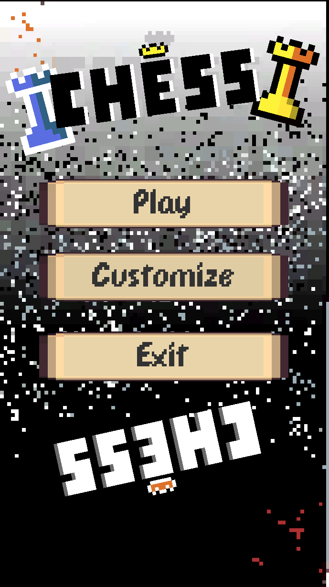
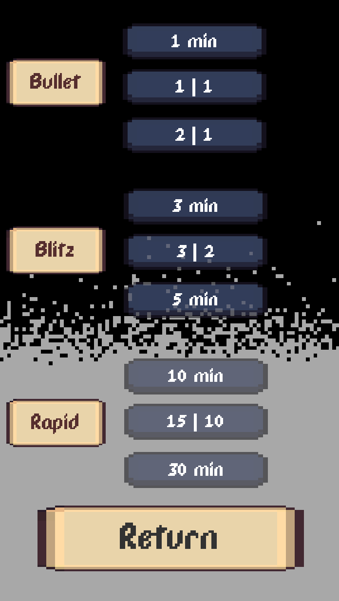
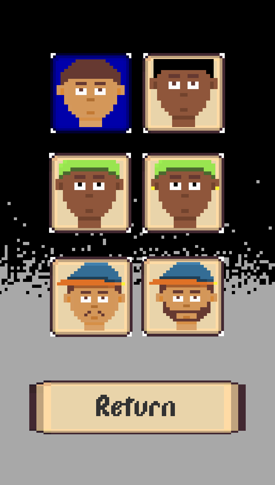
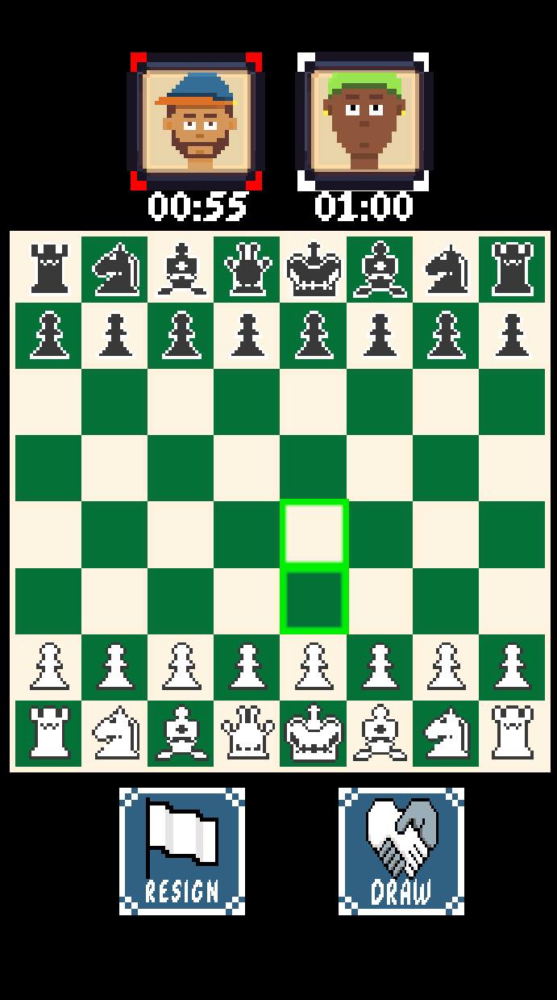

ChessGame ♟️

Welcome to ChessGame, a modern take on the classical chess game built in Unity! This project offers a fully functional local chess experience with various gameplay modes and features. Whether you're a casual player or a competitive enthusiast, there's something here for everyone.

🎮 About the Project

ChessGame is a local multiplayer chess game designed with a resolution of 16:9, developed using Unity 2022.3.44f1. It provides an immersive chess-playing experience with multiple game modes and advanced rules.

Key Features:
Classic Chess Rules: Includes all standard chess pieces and their movement/capturing rules:
8 Pawns, 2 Knights, 2 Bishops, 2 Rooks, 1 Queen, and 1 King.

 Advanced Chess Mechanics: Supports advanced rules such as:Check and Checkmate, En Passant, Pawn Promotion, Ask for Draw, Surrender.

Highlight Legal Moves: Visual indicators show valid moves for selected pieces.

Diverse Gameplay Modes: Compete in official tournament-style chess modes:
Bullet, Blitz, and Rapid.

Customizable Avatars: Choose from 8 unique avatars for each player.

🛠️ Installation Instructions

Follow these steps to get started:

Download Unity:

Ensure you have Unity version 2022.3.44f1 installed on your system.

You can download it from the Unity Hub.

Clone the Repository:

Clone or download the project files from the repository:

git clone <repository-url>

Open the Project:

Launch Unity Hub.

Click on "Open Project" and navigate to the folder where the chess game files are located.

Build and Run:

Open the Build Settings in Unity (File > Build Settings).

Select your target platform (e.g., PC, Mac, Linux, etc.).

Click "Build" to create an executable file, or click "Play" in the Unity Editor to test the game.

📸 Screenshots

Here’s a glimpse of what ChessGame looks like:

Main Menu

Gameplay Options

Avatar Selection

In-Game Action

🚀 Future Improvements

We’re constantly working to enhance the game. Here are some planned updates:

Multiplayer Mode: Allow players to connect online and compete against each other.

AI Chess Bot: Introduce an AI opponent so single players can enjoy solving chess puzzles or playing against different difficulty levels.

📬 Contact

If you encounter any issues or have suggestions for improvement, feel free to reach out:

Email: duy.nguyen280805@hcmut.edu.vn

GitHub: ItsDuy

Enjoy playing chess! ♟️

“Chess is the gymnasium of the mind.” – Blaise Pascal
